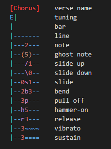
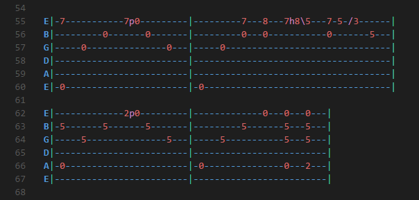
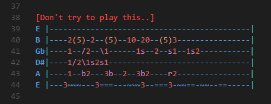

Guitar Tab Colorizer
=============

A syntax highlighter for guitar tabs in VSCode.
Uses TextMate language format so migrations to other editors should be possible.

## Installation

Place the entire 'guitar' folder in `<Your VSCode Install Path>\resources\app\extensions`
File extensions recognized:
- .tab
- .guitar
- .guitartab

## Syntax Definitions

## Example 1
A regular usage example:

## Example 2
Showing various combinations:

